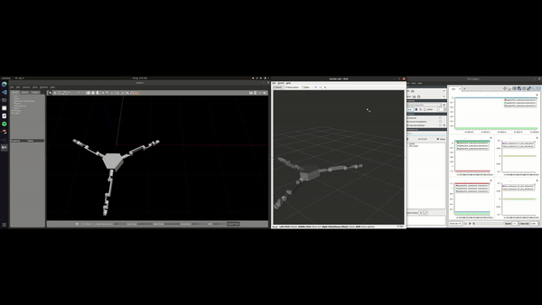
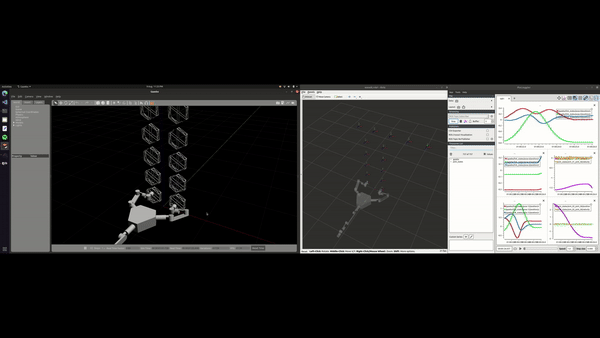

# Motion Planning and Control of Multi-Arm Robot for In-Orbit Operations
A ROS-Gazebo based simulation showcasing the motion planning and control framework for a multi-manipulator system for in-orbit operations.

Developed as part of MSc thesis titled "Motion Planning and Control of Multi-Arm Robot for In-Orbit Operations" 
by ***Sairaj R Dillikar (MSc Robotics 2022-23, Cranfield University, United Kingdom)***

Simulation videos of this project can be accessed by clicking [here](http://tinyurl.com/MotionPlanning-MARIO).

## Table of Contents

- [Build the Package](#build-the-package)
    - [Requirements](#requirements)
    - [Modifications to be made in the SRS Spawning Package](#modifications-to-be-made-in-the-srs-spawning-package)
- [Launch the Simulation](#launch-the-simulation)
    - [Execute Serial (a) Locomotion](#execute-serial-a-locomotion)
    - [Execute Serial (b) Locomotion](#execute-serial-b-locomotion)
    - [Execute Parallel Locomotion](#execute-parallel-locomotion)
    - [Execute Combined Locomotion (both Serial and Parallel)](#execute-combined-locomotion-both-serial-and-parallel)
- [Citation](#citation)
    - [Publication](#publication)
    - [Repository](#repository)
- [Contact](#contact)

## Build the Package

````
mkdir -p mario_mpcc_ws/src
cd mario_mpcc_ws/src
catkin_init_workspace
git clone https://github.com/sairajdillikar/Motion_Planning_and_Control_of_Multi_Arm_Robot_for_In_Orbit_Operations.git
cd ..
catkin build
````

### Requirements

- [Ubuntu 2020.04](https://releases.ubuntu.com/focal/)
- [ROS Noetic Ninjemys 8](https://wiki.ros.org/noetic)
- [Gazebo v11.11](https://classic.gazebosim.org/tutorials?tut=ros_installing&cat=connect_ros)
- Moveit! 1.0 for ROS Neotic
    - [Binary Install](https://moveit.ai/install/)
    - [Source Build: Linux](https://moveit.ai/install/source/)
    - [Moveit Visual Tools](https://github.com/moveit/moveit_visual_tools/tree/noetic-devel)
- [Python 3.7](https://www.python.org/downloads/release/python-370/)
- [*ros_link_attacher*](https://github.com/pal-robotics/gazebo_ros_link_attacher) Plugin (already included within this repository ([/gazebo_ros_link_attacher](gazebo_ros_link_attacher)))

## Modifications to be made in the SRS Spawning Package

Before launching the gazebo world, navigate through the packages to find the `src/simplified_df_bot_description/src/exe_serial_coordmotion_1.cpp` file and make sure to add your PC **`$USERNAME`** within the `<uri>` tag. Same goes for the `src/exe_serial_coordmotion_2.cpp`, `src/exe_parallel_coordmotion_1.cpp`, and `src/exe_combined_coordmotion_1.cpp`


    <uri>/home/ $USERNAME /mario_mpcc_ws/src/srs_modules_description/meshes/base_link.stl</uri>

    import subprocess
    user_name = subprocess.check_output("echo ${SUDO_USER:-${USER}}", shell=True).strip()
            home_var_path = '/home/'+user_name
            shell_path = home_var_path+"/mario_mpcc_ws/src/srs_modules_description/meshes/base_link.stl"


## Launch the Simulation

Before launching a simulation, any new terminal must be always sourced with,

    cd mario_mpcc_ws
    source devel/setup.bash

Use the above two commands when using a new terminal, as executing simulation for each different locomotion requires only two main commands: 
1. For launching the simulation (`roslaunch`).
2. To run the script with its respective control algorithm (`rosrun`).

### Execute Serial (a) Locomotion (Lateral Movement):

Terminal-1: 
    
    roslaunch simplified_df_bot_description execute_serial_locomotion.launch

Terminal-2: 

    rosrun simplified_df_bot_description exe_serial_coordmotion_1

<p align="center">
  
</p>

### Execute Serial (b) Locomotion (Lateral Movement):

Terminal-1:

    roslaunch simplified_df_bot_description execute_serial_locomotion.launch

Terminal-2:
    
    rosrun simplified_df_bot_description exe_serial_coordmotion_2

<p align="center">
  
</p>

### Execute Parallel Locomotion (Vertical Movement):

Terminal-1:

    roslaunch simplified_df_bot_description execute_parallel_locomotion.launch

Terminal-2:

    rosrun simplified_df_bot_description exe_parallel_coordmotion_1

<p align="center">
  
</p>

### Execute Combined Locomotion (both Serial/Lateral and Parallel/Vertical):

Terminal-1:

    roslaunch simplified_df_bot_description execute_combined_locomotion.launch

Terminal-2:

    rosrun simplified_df_bot_description exe_combined_coordmotion_1

<p align="center">
  
</p>

## Citation

If you use the Motion Planning architecture as part of a publication or utilise in a project development, please use the Bibtex below as a citation,

### Publication:
This publication can be accessed at DOI: [10.1007/978-3-031-72062-8_9](https://doi.org/10.1007/978-3-031-72062-8_9)
```bibtex
@InProceedings{10.1007/978-3-031-72062-8_9,
author="Dillikar, Sairaj R.
and Leslie, Cameron
and Upadhyay, Saurabh
and Felicetti, Leonard
and Tang, Gilbert",
editor="Huda, M. Nazmul
and Wang, Mingfeng
and Kalganova, Tatiana",
title="A ROS-Based Control Framework for Simulating Locomotion of a Multi-arm Space Assembly Robot",
booktitle="Towards Autonomous Robotic Systems",
year="2025",
publisher="Springer Nature Switzerland",
address="Cham",
pages="93--105",
abstract="This paper proposes a ROS-based control framework for simulating the locomotion of a multi-arm space robot on a planar space structure. This framework has applications in technology demonstrations of space structure assembly, construction, and maintenance where a multi-arm robot has to traverse on a space structure building blocks known as Spatial Reticular Structures (SRS) to perform the space operation. The framework sets the desired environment and SRS structures in the first step and devises two movement primitives to achieve locomotion on the structure. A ROS-Gazebo-based simulation architecture is presented to execute the proposed control framework. The viability and limitations of the proposed control framework are discussed with simulation results.",
isbn="978-3-031-72062-8"
}
```

### Repository:
```bibtex
@misc{motion_planning_mario_git,
  author       = {Dillikar, Sairaj.R. and Upadhyay, Saurabh and Felicetti, Leonard and Tang, Gilbert},
  booktitle    = {GitHub repository},
  publisher    = {GitHub},
  title        = {Motion Planning and Control of Multi-Arm Robot for In-Orbit Operations},
  month        = {Sep},
  year         = {2023},
  url          = {https://github.com/sairajdillikar/Motion-Planning-and-Control-of-Multi-Arm-Robot-for-In-Orbit-Operations}
}
```

## Contact

For questions, suggestions, or collaborations, feel free to reach out to the project author at [sairajdillikar@gmail.com](mailto:sairajdillikar@gmail.com).
